Software engineer joining **Intuit** in NYC, June 2026. Previously NOAA, John Deere (×2), Verrus.

Currently building [Sanji](https://sanji.dev), a localhost replacement for NotebookLM that runs on your Obsidian vault.

---

### What I'm building

| Repo | What it is |
|---|---|
| **[Sanji](https://github.com/rohanc2k4/sanji)** | A localhost study buddy. Drop PDFs, DOCX, or markdown notes in front of him and he'll read them all, sit with you while you work, and answer anything you ask. Notes never leave your machine. [sanji.dev →](https://sanji.dev) |
| **[Agentic Brain](https://github.com/rohanc2k4/agentic-brain)** | An opinionated second-brain framework for Claude Code. 15 skills, 4 hooks, file-based markdown, and a knowledge graph that grows as you use it. |
| **[rohan2k4.com](https://github.com/rohanc2k4/personal-site)** | A small one-page newspaper. Set in Fraunces and JetBrains Mono. [rohan2k4.com →](https://rohan2k4.com) |

### Past

- **NOAA** (2023). Modeled 14.7M Arctic grid cells for least-cost sea-ice routing. The routing module I contributed was integrated into NOAA's global voyage-planning system.
- **John Deere** (2024). Optimized the ML deployment path on Databricks Model Serving, AWS Lambda, and Terraform. Sustained 16,500 req/s; cut deployment failures 30%.
- **John Deere** (2025). Led the Spark to Microsoft Fabric migration on the dealer-notification pipeline. $676K per year in savings, 73% job-cost reduction.
- **Verrus** (2025 to June 2026). Software Infrastructure intern at an Alphabet-backed AI infrastructure startup. Built the first automated CD path (ArgoCD, Helm, Harbor on EKS-A) and a 6-node distributed NATS observability stack.

---

Metrics regenerated daily via <a href="https://github.com/lowlighter/metrics">lowlighter/metrics</a>.

---

[rohan2k4.com](https://rohan2k4.com) · [LinkedIn](https://linkedin.com/in/rohanchawla2004) · rohanchawla2004@gmail.com
